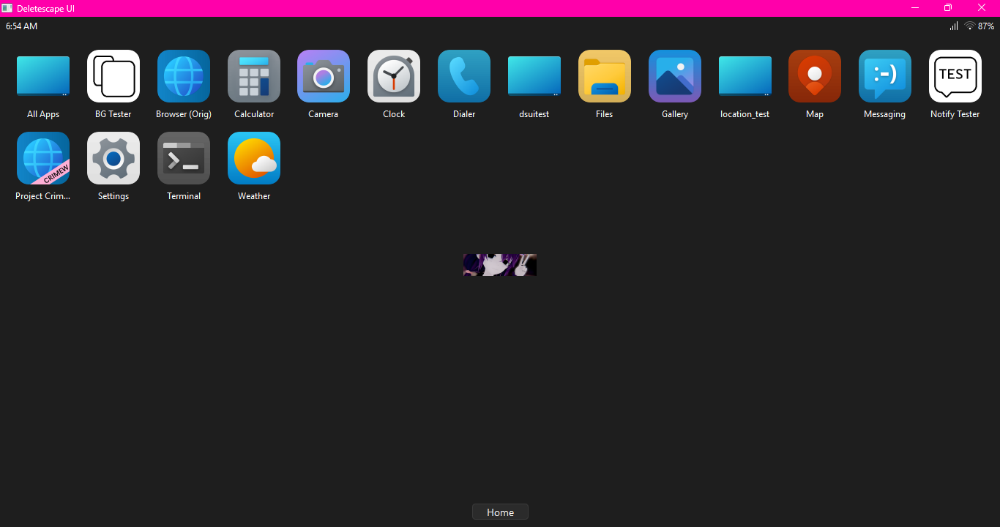

# netsh wifi driver fails when Location Services is disabled in Windows (BUG) (#1) (WiFi HAL)
Log:
```log
2026-03-02 08:35:44.721 drivers.wifi.netsh[15136:10040] DEBUG Netsh Wi-Fi get_wifi_info requested (taskName=None)
2026-03-02 08:35:44.722 drivers.wifi.netsh[15136:10040] DEBUG Running netsh command (cmd=['netsh', 'wlan', 'show', 'interfaces'] taskName=None timeout=8)
2026-03-02 08:35:45.441 drivers.wifi.netsh[15136:10040] DEBUG netsh command finished (cmd=['netsh', 'wlan', 'show', 'interfaces'] returncode=1 stderr_len=0 stdout_len=627 taskName=None)
2026-03-02 08:35:45.444 drivers.wifi.netsh[15136:10040] WARNING netsh command failed (cmd=['netsh', 'wlan', 'show', 'interfaces'] stderr='' taskName=None)
2026-03-02 08:35:45.449 drivers.wifi.netsh[15136:10040] INFO No netsh interface output (taskName=None)
```

Netsh output for this command:
```text
There is 1 interface on the system:
Network shell commands need location permission to access WLAN information. Turn on Location services on the Location page in Privacy & security settings.

Here is the URI for the Location page in the Settings app:
ms-settings:privacy-location
To open the Location page in the Settings app, hold down the Ctrl key and select the link, or run the following command:
start ms-settings:privacy-location

Or, to open the Location page from the Run dialog box, press Windows logo key + R, and then copy and paste the URI above.

Function WlanQueryInterface returns error 5:
The requested operation requires elevation (Run as administrator).
```

# Project Crimew crashes on forced new tab links (BUG) (#2) (Crimew)
```
Error calling Python override of QWebEngineView::createWindow(): 2026-03-02 08:52:43.802 crash[19128:10052] ERROR Unhandled exception (sys.excepthook)
Traceback (most recent call last):
  File "C:\Users\MarinEM28\Downloads\phoneos_1\phoneos\apps\crimew\webview.py", line 158, in createWindow
    return main_window.tab_widget().create_tab()
           ^^^^^^^^^^^^^^^^^^^^^^
AttributeError: 'Deletescape' object has no attribute 'tab_widget' (taskName=None)
2026-03-02 08:52:43.806 home[19128:10052] ERROR App crash reported
Traceback (most recent call last):
  File "C:\Users\MarinEM28\Downloads\phoneos_1\phoneos\apps\crimew\webview.py", line 158, in createWindow
    return main_window.tab_widget().create_tab()
           ^^^^^^^^^^^^^^^^^^^^^^
AttributeError: 'Deletescape' object has no attribute 'tab_widget' (active_app_id='crimew' taskName=None)
Traceback (most recent call last):
  File "C:\Users\MarinEM28\Downloads\phoneos_1\phoneos\apps\crimew\webview.py", line 158, in createWindow
    return main_window.tab_widget().create_tab()
           ^^^^^^^^^^^^^^^^^^^^^^
AttributeError: 'Deletescape' object has no attribute 'tab_widget'
```

When I click on a link on a webpage that forces creation of a new tab, the browser throws this exception, causing this dialog to appear from the system crash handler:

```
---------------------------
App crashed
---------------------------
Project Crimew (id: crimew) experienced an error and had to be closed.
---------------------------
OK   
---------------------------
```

# Project Crimew shows window close warning after close (FIXME) (#3) (Crimew)

When closing Project Crimew with mutiple tabs open, after the window is already closed, this dialog will appear: 

```
---------------------------
Confirm close
---------------------------
Are you sure you want to close the window?
There are 2 tabs open.
---------------------------
&Yes   &No   
---------------------------
```

Nothing seems to happen if you click either button, as I'm pretty sure the browser is already unloaded.

# EscCaptive exit w/o WAN dialog uses bad grammar (FIXME) (#4) (EscCaptive)

otdo

# Home screen wallpaper causes issues with resizing (BUG) (#5) (Home)

If a home screen wallpaper is set, you are unable to resize the window while at the home screen. 

# (FIXED) Home screen doesn't display home screen wallpaper image at window size (BUG) (#5) (Home)

The home screen wallpaper displays at the wrong size, being very small instead of scaling with the available window area.



